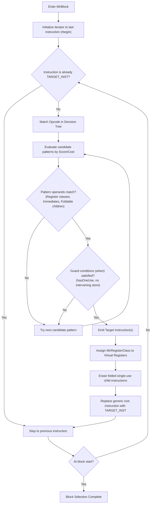

# MirInstructionSelector & EzDSL Integration Architectural Plan

## 1. Executive Summary

This specification defines the complete architectural blueprint and step-by-step implementation plan for the target **Instruction Selector** ([`MirInstructionSelector`](file:///E:/Repos/EzPacker/EzTriple/include/InstructionSelector/MirInstructionSelector.h)) in **`EzTriple`**, and its end-to-end integration with the domain-specific language **`EzDsl`**.

### Core Problem Statement
In the EzPacker backend compilation pipeline:

```mermaid
flowchart LR
    Frontend["EzFrontend AST"] --> ASTLowerer["EzAstLowerer"]
    ASTLowerer --> GenericMIR["Generic Legal MIR"]
    GenericMIR --> Legalizer["MirLegalizerPass (.lad/.lrd)"]
    Legalizer --> AbiLowerer["MirAbiLowererPass (.ccdf)"]
    AbiLowerer --> ISel["MirInstructionSelectorPass (.idf/.isf)"]
    ISel --> RegAlloc["MirRegisterAllocatorPass (Chaitin-Briggs)"]
    RegAlloc --> FrameLowerer["MirFrameLowererPass"]
    FrameLowerer --> Emitter["EzCodeEmitter (MC)"]
```


1. **The Legalized MIR State**: After `MirLegalizer` and `MirAbiLowerer`, instructions consist entirely of generic MIR opcodes (`ADD`, `SUB`, `MUL`, `LOAD`, `STORE`, `CMP_EQ`, `BR_COND`, etc.) operating on target-legalized scalar types (`i32`, `i64`, `f32`, `ptr`). All virtual registers (`MirRegister`) are unconstrained (`getClass() == nullptr`).
2. **The Register Allocator Requirement**: The subsequent pass, [`MirRegisterAllocator`](file:///E:/Repos/EzPacker/EzTriple/include/RegisterAllocator/MirRegisterAllocator.h), requires:
   - Every instruction must be an allocated machine instruction ([`MirInstruction::isSelected() == true`](file:///E:/Repos/EzPacker/EzMir/src/Instruction/MirInstruction.cpp#L31-L34), opcode `TARGET_INST` with non-null [`MirTargetInstructionDesc*`](file:///E:/Repos/EzPacker/EzMir/include/Instruction/MirTargetInstructionDesc.h)).
   - Every virtual register operand MUST have an assigned [`MirRegisterClass*`](file:///E:/Repos/EzPacker/EzMir/include/Operand/MirRegisterClass.h) (e.g. `GPR32`, `GPR64`, `FPR64`).
3. **The Current Gap**: `MirInstructionSelector` is currently a skeletal stub ([`MirInstructionSelector.cpp`](file:///E:/Repos/EzPacker/EzTriple/src/InstructionSelector/MirInstructionSelector.cpp)). Target instructions are not formal EzDSL artifacts, and there is no automated pattern matcher or addressing-mode folder.

### Architectural Goals
1. **DAG / Tree Pattern Matching Engine**: Transform generic MIR instruction trees within basic blocks into hardware target instructions using Bottom-Up Maximal Munch with cost-based prioritization.
2. **First-Class Addressing Mode Folding**: Recognize complex target addressing modes (e.g., x86 `[Base + Index * Scale + Disp]`, ARM64 `[Base, Offset]`) from generic arithmetic/shift trees and fold them directly into hardware memory operands.
3. **Strict Register Class Assignment**: Automatically constrain virtual registers to hardware register classes during selection, resolving operand constraints and inserting copies when physical registers are mandated by the architecture (e.g. x86 `IDIV` using `RAX:RDX`).
4. **Declarative EzDSL Specification**:
   - **Target Instruction Definitions (`.idf`)**: Declaratively define target machine opcodes, register classes, operand directions, implicit register defs/uses, and instruction flags.
   - **Instruction Selection Patterns (`.isf`)**: Declaratively specify multi-node pattern trees, operand classifiers, condition guards (`when`), addressing modes (`addrmode`), and target emissions (`select`) with associated costs.
5. **Production C++ Code Generation**: Synthesize standalone, high-performance C++ decision-tree matchers (`<Target>InstructionSelector.h/.cpp`) and target instruction descriptor tables (`<Target>TargetInstructionTable.h/.cpp`) via EzDSL code generators.

---

## 2. Current Implementation Audit & Technical Debt Analysis

### 2.1 The Instruction Selector Skeleton
In [`EzTriple/src/InstructionSelector/MirInstructionSelector.cpp`](file:///E:/Repos/EzPacker/EzTriple/src/InstructionSelector/MirInstructionSelector.cpp#L24-L51):
```cpp
bool MirInstructionSelector::selectBlock(MirBuilderContext *ctx, MirBlock *block)
{
    auto &instList = block->getInstructions();
    auto it = instList.begin();
    while (it != instList.end())
    {
        MirInstruction *inst = *it;
        auto nextIt = std::next(it);
        if (inst && inst->getTargetDesc() == nullptr)
        {
            if (!select(ctx, inst))
            {
                ctx->getDiagCollector()->error("MirInstructionSelector", "Could not select instruction")
                        << inst->getSourceRef();
                return false;
            }
        }
        it = nextIt;
    }
    return true;
}
```

#### Deficiencies & Hazards
1. **Single-Instruction Limitation**: The signature `virtual bool select(MirBuilderContext *ctx, MirInstruction *inst) = 0` implies 1:1 replacement. It cannot naturally fold a tree of instructions (e.g. `(ADD rd, (LOAD ptr), rs2) -> ADD32rm rd, ptr, rs2`) because `LOAD` is visited first in top-down iteration without knowledge of its consumer.
2. **Missing Folding Hazards / Aliasing Checks**: If `LOAD` is folded into a later `ADD`, there must be no intervening `STORE` to overlapping memory. Without an active dependency/hazard tracker, memory reordering bugs will occur.
3. **No Dead Code Cleanup for Folded Nodes**: When an internal tree node (like a folded load or address addition) is consumed by a root target instruction, it must be removed from the block if it has no other uses (`hasOneUse`).
4. **Top-Down vs Bottom-Up**: Top-down linear iteration requires speculative lookahead. Bottom-up iteration (from block terminator upwards) naturally processes consumers before producers, allowing consumed nodes to be marked as dead/folded before their turn.

---

### 2.2 Register Class Gap in Target Descriptors
In [`EzMir/include/Instruction/MirTargetInstructionDesc.h`](file:///E:/Repos/EzPacker/EzMir/include/Instruction/MirTargetInstructionDesc.h#L12-L48):
```cpp
class MirTargetInstructionDesc
{
  public:
    MirTargetInstructionDesc(const char *name,
                             size_t id,
                             std::initializer_list<MirOperandFlag> operandFlags = {},
                             std::initializer_list<MirRegisterRef> implicitDefs = {},
                             std::initializer_list<MirRegisterRef> implicitUses = {});
    // ...
  private:
    const char *m_name;
    size_t m_id;
    std::vector<MirOperandFlag> m_operandsFlags;
    std::vector<MirRegisterRef> m_implicitDefs;
    std::vector<MirRegisterRef> m_implicitUses;
};
```

#### Deficiencies
1. **No Register Class Constraints**: `MirTargetInstructionDesc` records operand access flags (`Read`, `Write`), but does NOT record which [`MirRegisterClass*`](file:///E:/Repos/EzPacker/EzMir/include/Operand/MirRegisterClass.h) each operand requires (e.g., operand 0 of `ADD32rr` requires `GPR32`, while operand 0 of `ADD64rr` requires `GPR64`).
2. **Virtual Register Class Invariant**: [`MirRegister::setClass`](file:///E:/Repos/EzPacker/EzMir/include/Operand/MirOperands.h#L278) must be called on every virtual register. If instruction selection does not constrain virtual registers, [`MirRegisterAllocator::buildInterferenceGraph`](file:///E:/Repos/EzPacker/EzTriple/src/RegisterAllocator/MirRegisterAllocator.cpp) fails immediately.

---

### 2.3 Memory Addressing Representation
In [`EzMir/include/Operand/MirOperands.h`](file:///E:/Repos/EzPacker/EzMir/include/Operand/MirOperands.h#L310-L355):
```cpp
class MirMemory : public MirOperand
{
  public:
    MirMemory(MirType *type, MirRegister *base, MirInteger *displ, SourceReference *ref);
    MirRegister *getBase() const { return m_base; }
    MirInteger *getDisplacement() const { return m_displ; }
  private:
    MirRegister *m_base;
    MirInteger *m_displ;
};
```

#### Deficiencies
- `MirMemory` only models `[Base + Displacement]`.
- CISC architectures (x86/x86-64) require SIB addressing: `[Base + Index * Scale + Disp]` where `Scale ∈ {1, 2, 4, 8}`.
- RISC architectures (ARM64) require shifted-register offsets: `[Base, Index, LSL #shift]`.
- Extending `MirMemory` with optional `index` and `scale` enables hardware-accurate addressing without breaking existing base+disp usage.

---

## 3. Core Instruction Selection Architecture (`EzTriple`)

### 3.1 Extended Memory Operand Model
Enhance [`MirMemory`](file:///E:/Repos/EzPacker/EzMir/include/Operand/MirOperands.h#L310) to support full hardware addressing modes:

```cpp
class MirMemory : public MirOperand
{
  public:
    static constexpr MirOperandType OpKind = MirOperandType::Memory;

    MirMemory(MirType *type,
              MirRegister *base,
              MirInteger *displ,
              MirRegister *index = nullptr,
              uint8_t scale = 1,
              SourceReference *ref = nullptr);

    MirRegister *getBase() const { return m_base; }
    MirInteger *getDisplacement() const { return m_displ; }
    MirRegister *getIndex() const { return m_index; }
    uint8_t getScale() const { return m_scale; }

    bool hasBaseReg() const { return m_base != nullptr; }
    bool hasIndexReg() const { return m_index != nullptr; }
    bool isSimpleBaseDisp() const { return m_index == nullptr && m_scale <= 1; }

    std::string toString() const override;

  private:
    MirRegister *m_base{ nullptr };
    MirInteger *m_displ{ nullptr };
    MirRegister *m_index{ nullptr };
    uint8_t m_scale{ 1 };
};
```

Update [`MirOperandBuilder`](file:///E:/Repos/EzPacker/EzMir/include/Operand/MirOperandBuilder.h) to expose overloaded `buildMem(...)` accepting `(type, base, displ, index, scale)`.

---

### 3.2 Enhanced Target Instruction Descriptor
Enhance [`MirTargetInstructionDesc`](file:///E:/Repos/EzPacker/EzMir/include/Instruction/MirTargetInstructionDesc.h) to record operand register class constraints:

```cpp
class MirTargetInstructionDesc
{
  public:
    MirTargetInstructionDesc(const char *name,
                             size_t id,
                             std::initializer_list<MirOperandFlag> operandFlags = {},
                             std::initializer_list<MirRegisterClass *> operandClasses = {},
                             std::initializer_list<MirRegisterRef> implicitDefs = {},
                             std::initializer_list<MirRegisterRef> implicitUses = {},
                             MirInstructionFlags targetFlags = MirInstructionFlags::None);

    const char *getName() const;
    size_t getId() const;
    const std::vector<MirOperandFlag> &getOperandsFlags() const;
    const std::vector<MirRegisterClass *> &getOperandClasses() const;
    const std::vector<MirRegisterRef> &getImplicitDefs() const;
    const std::vector<MirRegisterRef> &getImplicitUses() const;
    MirInstructionFlags getTargetFlags() const;

    MirRegisterClass *getOperandClass(size_t index) const;

  private:
    const char *m_name;
    size_t m_id;
    std::vector<MirOperandFlag> m_operandsFlags;
    std::vector<MirRegisterClass *> m_operandClasses;
    std::vector<MirRegisterRef> m_implicitDefs;
    std::vector<MirRegisterRef> m_implicitUses;
    MirInstructionFlags m_targetFlags;
};
```

---

### 3.3 The Bottom-Up Maximal Munch Pattern Matching Engine
Instruction selection within a basic block operates **bottom-up**:



#### Hazard & Safety Conditions for Tree Folding
1. **Single-Use Check (`hasOneUse`)**:
   - If an instruction `v0 = LOAD p` is folded into `ADD v1, v0, v2 -> ADD32rm v1, p, v2`, `v0` must not be read by any other instruction in the function.
   - If `v0` has multiple uses, folding it into `ADD32rm` would necessitate re-loading the memory or leaving other uses dangling.
2. **Memory Disambiguation / Intervening Store Check**:
   - Between the producer `v0 = LOAD p` and the consumer `ADD v1, v0, v2`, there must not be any instruction writing to memory (`WritesMemory` or `HasSideEffect`).
   - If an intervening store exists, the load cannot be sunk into the consumer.
3. **Commutative Matching**:
   - For commutative opcodes (`ADD`, `MUL`, `AND`, `OR`, `XOR`, `CMP_EQ`, `CMP_NE`), the matcher automatically attempts operand permutation: `(OP A, B)` and `(OP B, A)`.
   - This allows `(ADD %reg, (LOAD %ptr))` to match even if the user wrote `ADD (LOAD %ptr), %reg`.

---

### 3.4 Addressing Mode Matcher (`MirAddressingModeMatcher`)
Introduce a dedicated target interface for decomposing address expressions into `MirMemory` components:

```cpp
struct MatchedAddressingMode
{
    MirRegister *m_base{ nullptr };
    int64_t m_disp{ 0 };
    MirRegister *m_index{ nullptr };
    uint8_t m_scale{ 1 };
    std::vector<MirInstruction *> m_foldedInstructions;
};

class MirAddressingModeMatcher
{
  public:
    virtual ~MirAddressingModeMatcher() = default;

    /**
     * Matches an address operand (register or pointer computation tree) into hardware addressing mode.
     */
    virtual bool matchAddress(MirBuilderContext *ctx,
                              MirOperand *addrOp,
                              MatchedAddressingMode &outMode) = 0;
};
```

For x86-64, the matcher recognizes:
- `reg` $\to$ `[reg + 0]`
- `ADD reg, imm` $\to$ `[reg + imm]`
- `ADD reg1, reg2` $\to$ `[reg1 + reg2 * 1 + 0]`
- `SHL reg, 1/2/3` $\to$ `[0 + reg * (1<<shift) + 0]`
- `ADD reg1, (SHL reg2, scale)` $\to$ `[reg1 + reg2 * (1<<scale) + 0]`
- `ADD (ADD reg1, (SHL reg2, scale)), disp` $\to$ `[reg1 + reg2 * (1<<scale) + disp]`

---

### 3.5 Physical Register Spilling & ABI Shims
Certain target instructions strictly require dedicated physical registers:
- x86-64 `IDIV`: Requires dividend in `RAX` (and sign-extended into `RDX`), divisor in operand, writes quotient to `RAX`, remainder to `RDX`.
- x86-64 `SHL` / `SHR` / `SAR` with variable count: Requires shift amount in physical register `CL`.

The instruction selector handles this cleanly:
```cpp
// Example: Lowering generic DIV/IDIV to x86-64 IDIV
// 1. Copy lhs to RAX
ib.buildTarget(descMOV64rr, srcRef, { pregRAX, vregLhs });
// 2. Sign-extend RAX into RDX (CQO)
ib.buildTarget(descCQO, srcRef, {});
// 3. Emit IDIV
ib.buildTarget(descIDIV64r, srcRef, { vregDivisor });
// 4. Copy quotient from RAX to dst
ib.buildTarget(descMOV64rr, srcRef, { vregDst, pregRAX });
```

---

## 4. EzDSL Dialect & Syntax Specifications

To eliminate handwritten C++ decision trees, EzDSL is extended with two dedicated sub-languages:
1. **Target Instruction Definitions (`.idf`)**: Hardware instruction metadata catalog.
2. **Instruction Selection Patterns (`.isf`)**: Pattern matching and emission rules.

---

### 4.1 Target Instruction Definitions (`.idf`)

#### Grammar Overview
```dsl
// Target Instruction Definition Language (.idf)
target_inst ADD32rr(GPR32:dst OUT, GPR32:src1 IN, GPR32:src2 IN) {
    MNEMONIC("addl");
    FLAGS(IsCommutative);
    IMPLICIT_DEFS(EFLAGS);
};

target_inst ADD32ri(GPR32:dst OUT, GPR32:src IN, i32imm:imm IN) {
    MNEMONIC("addl");
    IMPLICIT_DEFS(EFLAGS);
};

target_inst ADD32rm(GPR32:dst OUT, GPR32:src IN, Mem32:addr IN) {
    MNEMONIC("addl");
    FLAGS(ReadsMemory);
    IMPLICIT_DEFS(EFLAGS);
};

target_inst IDIV32r(GPR32:divisor IN) {
    MNEMONIC("idivl");
    FLAGS(HasSideEffect);
    IMPLICIT_USES(EAX, EDX);
    IMPLICIT_DEFS(EAX, EDX, EFLAGS);
};

target_inst JE(Label:target IN) {
    MNEMONIC("je");
    FLAGS(IsBranch, IsTerminator);
    IMPLICIT_USES(EFLAGS);
};
```

#### AST Structure ([`TargetInstDefLangAst.h`](file:///E:/Repos/EzPacker/EzDsl/Lexer/include/Ast/TargetInstDefLangAst.h))
```cpp
namespace DSL::Ast::TargetInstDef
{
enum class OperandDirection : uint8_t { In, Out, InOut };

struct TargetOperandDecl
{
    Common::Identifier m_regClassOrType; // e.g. "GPR32", "i32imm", "Mem32"
    Common::Identifier m_name;            // e.g. "dst", "src"
    OperandDirection m_direction;         // In, Out, InOut
};

struct TargetInstDecl
{
    Common::Identifier m_instName;                         // e.g. "ADD32rr"
    std::pmr::vector<TargetOperandDecl> m_operands;
    std::optional<Common::StringLiteral> m_mnemonic;       // e.g. "addl"
    std::pmr::vector<Common::Identifier> m_implicitDefs;   // e.g. ["EFLAGS"]
    std::pmr::vector<Common::Identifier> m_implicitUses;   // e.g. ["EAX", "EDX"]
    std::pmr::vector<Common::Identifier> m_flags;          // e.g. ["IsCommutative"]
};

struct TargetInstFile
{
    std::optional<Common::Identifier> m_targetName;
    std::pmr::vector<TargetInstDecl> m_instructions;
};
}
```

---

### 4.2 Instruction Selection Patterns (`.isf`)

#### Grammar Overview
```dsl
// Addressing Mode Specification
addrmode AddrModeRegImm(GPR64:base, simm32:disp = 0) {
    variant BaseDisp {
        match {
            ADD ptr:$base, imm(i32):$disp;
        };
        when {
            isSimm32($disp);
        };
    };
    variant BaseOnly {
        match {
            ptr:$base;
        };
    };
};

addrmode AddrModeSIB(GPR64:base, GPR64:index, imm:scale, simm32:disp = 0) {
    variant FullSIB {
        match {
            ADD (ADD ptr:$base, (SHL ptr:$index, imm:$shift)), imm(i32):$disp;
        };
        when {
            isValidScale($shift);
            isSimm32($disp);
        };
    };
};

// Selection Pattern: Simple Register-Register ALU
pattern Select_ADD32rr [cost = 1] {
    match {
        ADD i32:$dst, i32:$src1, i32:$src2;
    };
    select {
        ADD32rr GPR32:$dst, GPR32:$src1, GPR32:$src2;
    };
};

// Selection Pattern: Register-Immediate ALU with Range Predicate
pattern Select_ADD32ri [cost = 1] {
    match {
        ADD i32:$dst, i32:$src1, imm(i32):$imm;
    };
    when {
        isSimm32($imm);
    };
    select {
        ADD32ri GPR32:$dst, GPR32:$src1, $imm;
    };
};

// Selection Pattern: Memory-Folded Load ALU
pattern Select_ADD32rm [cost = 2] {
    match {
        ADD i32:$dst, i32:$src1, (LOAD i32:$tmp, AddrModeRegImm($base, $disp));
    };
    when {
        hasOneUse($tmp);
        noInterveningStore($tmp);
    };
    select {
        ADD32rm GPR32:$dst, GPR32:$src1, [$base, $disp];
    };
};

// Selection Pattern: Compare + Conditional Branch Fusion
pattern Select_BrCond_Eq [cost = 2] {
    match {
        BR_COND (CMP_EQ i1:$c, i32:$lhs, i32:$rhs), label:$trueTarget, label:$falseTarget;
    };
    when {
        hasOneUse($c);
    };
    select {
        CMP32rr GPR32:$lhs, GPR32:$rhs;
        JE $trueTarget;
        JMP $falseTarget;
    };
};
```

#### AST Structure ([`InstructionSelectDefLangAst.h`](file:///E:/Repos/EzPacker/EzDsl/Lexer/include/Ast/InstructionSelectDefLangAst.h))
```cpp
namespace DSL::Ast::InstructionSelectDef
{
struct PatternTree;

struct PatternOperand
{
    enum class Kind { SsaRegister, ImmediateLiteral, ImmediateSymbol, AddrModeRef, NestedTree };
    Kind m_kind;
    Common::Identifier m_name;
    std::optional<Common::Identifier> m_type;
    std::optional<Common::IntegerLiteral> m_literal;
    std::shared_ptr<PatternTree> m_nestedTree; // If Kind == NestedTree
};

struct PatternTree
{
    Common::Identifier m_opcode;
    std::pmr::vector<PatternOperand> m_operands;
};

struct PatternWhen
{
    Common::Identifier m_predicate;
    std::pmr::vector<std::variant<Common::Identifier, Common::IntegerLiteral>> m_args;
};

struct TargetEmitOperand
{
    enum class Kind { BoundVar, ImmLiteral, AddrModeMem, PhysReg };
    Kind m_kind;
    Common::Identifier m_name;
    std::optional<Common::Identifier> m_regClass;
    std::optional<Common::IntegerLiteral> m_literal;
};

struct TargetEmitInst
{
    Common::Identifier m_targetOpcode;
    std::pmr::vector<TargetEmitOperand> m_operands;
};

struct SelectionPattern
{
    Common::Identifier m_name;
    uint32_t m_cost{ 1 };
    PatternTree m_matchTree;
    std::pmr::vector<PatternWhen> m_whenClauses;
    std::pmr::vector<TargetEmitInst> m_selectClauses;
};

struct AddrModeVariant
{
    Common::Identifier m_variantName;
    PatternTree m_matchTree;
    std::pmr::vector<PatternWhen> m_whenClauses;
};

struct AddrModeDecl
{
    Common::Identifier m_modeName;
    std::pmr::vector<Common::Identifier> m_params;
    std::pmr::vector<AddrModeVariant> m_variants;
};

struct InstructionSelectFile
{
    std::optional<Common::Identifier> m_targetName;
    std::pmr::vector<AddrModeDecl> m_addressingModes;
    std::pmr::vector<SelectionPattern> m_patterns;
};
}
```

---

## 5. Automated Code Generation Specification

The code generation suite generates two synchronized components per target:
1. `<Target>TargetInstructionTable.h/.cpp` via `CppTargetInstructionGenerator`.
2. `<Target>InstructionSelector.h/.cpp` via `CppInstructionSelectorGenerator`.

---

### 5.1 Generated Target Instruction Descriptor Table
```cpp
// AMD64TargetInstructionTable.h (Auto-generated by EzDSL)
#ifndef EZTRIPLE_AMD64_TARGET_INSTRUCTION_TABLE_H
#define EZTRIPLE_AMD64_TARGET_INSTRUCTION_TABLE_H

#include "Instruction/MirTargetInstructionDesc.h"
#include <cstdint>

namespace EzTriple::AMD64TargetInst
{
enum OpCode : size_t
{
    ADD32rr = 1,
    ADD32ri = 2,
    ADD32rm = 3,
    IDIV32r = 4,
    JE      = 5,
    JMP     = 6,
    // ...
    OPCODE_COUNT
};

const MirTargetInstructionDesc *getTargetDesc(OpCode op);
void initializeTargetInstructionTable(TargetDesc *target);
}

#endif
```

```cpp
// AMD64TargetInstructionTable.cpp (Auto-generated by EzDSL)
#include "AMD64TargetInstructionTable.h"
#include "Descriptors/TargetDesc.h"
#include "Operand/MirRegisterClass.h"

namespace EzTriple::AMD64TargetInst
{
static MirTargetInstructionDesc s_descs[] = {
    { "ADD32rr", ADD32rr,
      { MirOperandFlag::Write, MirOperandFlag::Read, MirOperandFlag::Read },
      { /* GPR32 */ nullptr, /* GPR32 */ nullptr, /* GPR32 */ nullptr },
      { /* EFLAGS */ }, { /* none */ },
      MirInstructionFlags::IsCommutative },
    { "ADD32ri", ADD32ri,
      { MirOperandFlag::Write, MirOperandFlag::Read, MirOperandFlag::Read },
      { /* GPR32 */ nullptr, /* GPR32 */ nullptr, /* imm */ nullptr },
      { /* EFLAGS */ }, { /* none */ } },
    { "ADD32rm", ADD32rm,
      { MirOperandFlag::Write, MirOperandFlag::Read, MirOperandFlag::Read },
      { /* GPR32 */ nullptr, /* GPR32 */ nullptr, /* Mem */ nullptr },
      { /* EFLAGS */ }, { /* none */ },
      MirInstructionFlags::ReadsMemory },
    // ...
};

const MirTargetInstructionDesc *getTargetDesc(OpCode op)
{
    if (op == 0 || op > sizeof(s_descs)/sizeof(s_descs[0])) return nullptr;
    return &s_descs[op - 1];
}
}
```

---

### 5.2 Generated Instruction Selector Engine
```cpp
// AMD64InstructionSelector.h (Auto-generated by EzDSL)
#ifndef EZTRIPLE_AMD64_INSTRUCTION_SELECTOR_H
#define EZTRIPLE_AMD64_INSTRUCTION_SELECTOR_H

#include "InstructionSelector/MirInstructionSelector.h"
#include "Descriptors/TargetDesc.h"

namespace EzTriple
{
class AMD64InstructionSelector : public MirInstructionSelector
{
  public:
    explicit AMD64InstructionSelector(TargetDesc *targetDesc);
    bool select(MirBuilderContext *ctx, MirInstruction *inst) override;

  private:
    bool selectADD(MirBuilderContext *ctx, MirInstruction *inst);
    bool selectSUB(MirBuilderContext *ctx, MirInstruction *inst);
    bool selectBR_COND(MirBuilderContext *ctx, MirInstruction *inst);

    TargetDesc *m_targetDesc{ nullptr };
    MirRegisterClass *m_gpr32{ nullptr };
    MirRegisterClass *m_gpr64{ nullptr };
};
}
#endif
```

```cpp
// AMD64InstructionSelector.cpp (Auto-generated snippet)
bool AMD64InstructionSelector::selectADD(MirBuilderContext *ctx, MirInstruction *inst)
{
    // Pattern 1: Memory-Folded Load ADD32rm [cost = 2]
    {
        auto *dst = inst->getOperand(0)->get<MirRegister>();
        auto *src1 = inst->getOperand(1)->get<MirRegister>();
        auto *src2 = inst->getOperand(2)->get<MirRegister>();

        if (dst && src1 && src2 && dst->getType()->isI32())
        {
            // Attempt memory fold on src2 (or src1 if commutative)
            MirInstruction *defInst = getDefiningInstruction(ctx, src2);
            if (defInst && defInst->getOpCode() == MirInstructionOpCode::LOAD && hasOneUse(src2) && noInterveningStore(defInst, inst))
            {
                MatchedAddressingMode addrMode;
                if (matchAddrModeRegImm(ctx, defInst->getOperand(1), addrMode))
                {
                    MirInstructionBuilder ib(ctx, inst, InsertionType::Before);
                    MirOperandBuilder ob(ctx);

                    dst->setClass(m_gpr32);
                    src1->setClass(m_gpr32);
                    addrMode.m_base->setClass(m_gpr64);

                    auto *memOp = ob.buildMem(ctx->getTypeTable()->i32(),
                                             addrMode.m_base,
                                             ob.buildInt(ctx->getTypeTable()->i32(), addrMode.m_disp));

                    ib.buildTarget(AMD64TargetInst::getTargetDesc(AMD64TargetInst::ADD32rm),
                                   inst->getSourceRef(),
                                   { dst, src1, memOp });

                    defInst->eraseFromOwner();
                    inst->eraseFromOwner();
                    return true;
                }
            }
        }
    }

    // Pattern 2: Immediate ALU ADD32ri [cost = 1]
    {
        auto *dst = inst->getOperand(0)->get<MirRegister>();
        auto *src1 = inst->getOperand(1)->get<MirRegister>();
        auto *imm = inst->getOperand(2)->get<MirInteger>();
        if (dst && src1 && imm && dst->getType()->isI32())
        {
            if (isSimm32(imm->getValue().asInt64()))
            {
                MirInstructionBuilder ib(ctx, inst, InsertionType::Before);
                dst->setClass(m_gpr32);
                src1->setClass(m_gpr32);
                ib.buildTarget(AMD64TargetInst::getTargetDesc(AMD64TargetInst::ADD32ri),
                               inst->getSourceRef(),
                               { dst, src1, imm });
                inst->eraseFromOwner();
                return true;
            }
        }
    }

    // Pattern 3: Register-Register ALU ADD32rr [cost = 1]
    {
        auto *dst = inst->getOperand(0)->get<MirRegister>();
        auto *src1 = inst->getOperand(1)->get<MirRegister>();
        auto *src2 = inst->getOperand(2)->get<MirRegister>();
        if (dst && src1 && src2 && dst->getType()->isI32())
        {
            MirInstructionBuilder ib(ctx, inst, InsertionType::Before);
            dst->setClass(m_gpr32);
            src1->setClass(m_gpr32);
            src2->setClass(m_gpr32);
            ib.buildTarget(AMD64TargetInst::getTargetDesc(AMD64TargetInst::ADD32rr),
                           inst->getSourceRef(),
                           { dst, src1, src2 });
            inst->eraseFromOwner();
            return true;
        }
    }

    return false;
}
```

---

## 6. Step-by-Step Implementation Roadmap

### Phase 1: Core EzTriple ISel Infrastructure Enhancements
- [ ] **Task 1.1: Extended Memory Operand (`MirMemory`)**
  - Add optional `m_index` ([`MirRegister*`](file:///E:/Repos/EzPacker/EzMir/include/Operand/MirOperands.h)) and `m_scale` (`uint8_t`) to [`MirMemory`](file:///E:/Repos/EzPacker/EzMir/include/Operand/MirOperands.h#L310).
  - Update [`MirOperandBuilder::buildMem`](file:///E:/Repos/EzPacker/EzMir/include/Operand/MirOperandBuilder.h#L41) with overloads supporting SIB parameters.
  - Update [`MirPrinter`](file:///E:/Repos/EzPacker/EzMir/src/Printer/MirPrinter.cpp) to format `[base + index*scale + disp]`.
- [ ] **Task 1.2: Register Classes in `MirTargetInstructionDesc`**
  - Add `std::vector<MirRegisterClass*> m_operandClasses` to [`MirTargetInstructionDesc`](file:///E:/Repos/EzPacker/EzMir/include/Instruction/MirTargetInstructionDesc.h).
  - Add accessor `MirRegisterClass *getOperandClass(size_t index) const`.
- [ ] **Task 1.3: Bottom-Up Maximal Munch in `MirInstructionSelector`**
  - Update [`MirInstructionSelector::selectBlock`](file:///E:/Repos/EzPacker/EzTriple/src/InstructionSelector/MirInstructionSelector.cpp#L24) to iterate bottom-up.
  - Implement helper methods: `hasOneUse(MirRegister*)`, `noInterveningStore(MirInstruction* from, MirInstruction* to)`, `getDefiningInstruction(MirRegister*)`.
- [ ] **Task 1.4: Addressing Mode Matcher Hook**
  - Create [`EzTriple/include/InstructionSelector/MirAddressingModeMatcher.h`](file:///E:/Repos/EzPacker/EzTriple/include/InstructionSelector).
  - Hook into `TargetDesc::getAddressingModeMatcher()`.
- [ ] **Task 1.5: Handcrafted Mock Instruction Selector Verification**
  - Extend [`MockInstructionSelector`](file:///E:/Repos/EzPacker/tests/EzTripleTestSuite/include/EzTripleTestSuite.h#L82) with concrete target selection for `ADD`, `SUB`, `LOAD`, `STORE`, and `BR_COND`.
  - Constrain virtual registers to `MockTargetDesc::GPR64`.
  - Run `MirRegisterAllocator` directly on the selected output; verify zero assertion failures and clean coloring.

---

### Phase 2: EzDSL Target Instruction Language (`.idf`)
- [ ] **Task 2.1: AST Nodes Definition**
  - Implement [`EzDsl/Lexer/include/Ast/TargetInstDefLangAst.h`](file:///E:/Repos/EzPacker/EzDsl/Lexer/include/Ast).
  - Define `TargetInstDecl`, `TargetOperandDecl`, `OperandDirection`.
- [ ] **Task 2.2: Lexy Grammar & Parser**
  - Implement [`EzDsl/Lexer/include/Parser/TargetInstDefLang.h`](file:///E:/Repos/EzPacker/EzDsl/Lexer/include/Parser).
  - Support `target_inst`, `MNEMONIC`, `FLAGS`, `IMPLICIT_DEFS`, `IMPLICIT_USES`.
- [ ] **Task 2.3: Semantic Analysis Pass (`TargetInstPass`)**
  - Implement [`EzDsl/Sema/include/SemaPasses/TargetInstPass.h`](file:///E:/Repos/EzPacker/EzDsl/Sema/include/SemaPasses).
  - Validate register classes, flags, and implicit registers against target symbol table.
  - Register `TargetInstructionSymbol` into [`SymbolTable`](file:///E:/Repos/EzPacker/EzDsl/Sema/include/Sema/SymbolTable.h).
- [ ] **Task 2.4: Code Generator (`CppTargetInstructionGenerator`)**
  - Implement [`EzDsl/CodeGenerators/include/CodeGenerators/CppTargetInstructionGenerator.h`](file:///E:/Repos/EzPacker/EzDsl/CodeGenerators/include/CodeGenerators).
  - Synthesize `<Target>TargetInstructionTable.h` and `<Target>TargetInstructionTable.cpp`.
- [ ] **Task 2.5: CLI Integration**
  - Add `LanguageDialect::TargetInstDef` (`.idf`) and `GeneratorKind::TargetInstructions` to [`CommandLineOptions.h`](file:///E:/Repos/EzPacker/EzDsl/Cli/include/Cli/CommandLineOptions.h) and [`Driver.cpp`](file:///E:/Repos/EzPacker/EzDsl/Cli/src/Cli/Driver.cpp).
- [ ] **Task 2.6: Test Suite for `.idf`**
  - Add unit tests in `tests/EzDslLexerTestSuite` and `tests/EzDslCodeGeneratorsTestSuite`.

---

### Phase 3: EzDSL Instruction Selection Pattern Language (`.isf`)
- [ ] **Task 3.1: AST Nodes Definition**
  - Implement [`EzDsl/Lexer/include/Ast/InstructionSelectDefLangAst.h`](file:///E:/Repos/EzPacker/EzDsl/Lexer/include/Ast).
  - Define `SelectionPattern`, `AddrModeDecl`, `PatternTree`, `PatternWhen`, `TargetEmitInst`.
- [ ] **Task 3.2: Lexy Grammar & Parser**
  - Implement [`EzDsl/Lexer/include/Parser/InstructionSelectDefLang.h`](file:///E:/Repos/EzPacker/EzDsl/Lexer/include/Parser).
  - Support `pattern`, `addrmode`, `variant`, `match`, `when`, `select`, `cost`.
- [ ] **Task 3.3: Semantic Analysis Pass (`InstructionSelectPass`)**
  - Implement [`EzDsl/Sema/include/SemaPasses/InstructionSelectPass.h`](file:///E:/Repos/EzPacker/EzDsl/Sema/include/SemaPasses).
  - Validate generic opcodes against `IrInstructionSymbol`.
  - Validate target opcodes against `TargetInstructionSymbol`.
  - Verify variable binding consistency between `match`, `when`, and `select`.
- [ ] **Task 3.4: Code Generator (`CppInstructionSelectorGenerator`)**
  - Implement [`EzDsl/CodeGenerators/include/CodeGenerators/CppInstructionSelectorGenerator.h`](file:///E:/Repos/EzPacker/EzDsl/CodeGenerators/include/CodeGenerators).
  - Generate C++ decision tree matching opcode, operands, addressing modes, and predicates.
  - Automatically generate register class constraints (`reg->setClass(...)`).
  - Emit folded child erasing and instruction builder replacements.
- [ ] **Task 3.5: CLI Integration**
  - Add `LanguageDialect::InstructionSelect` (`.isf`) and `GeneratorKind::InstructionSelector` to `Driver.cpp`.
- [ ] **Task 3.6: Test Suite for `.isf`**
  - Add parser, sema, and code generation unit tests in `EzDslCodeGeneratorsTestSuite`.

---

### Phase 4: Full Pipeline Integration & Target Realization
- [ ] **Task 4.1: Target Integration (Mock & AMD64)**
  - Author `MockTargetInstructions.idf` and `MockSelectionPatterns.isf`.
  - Compile them using `ezdsl` into `MockTargetInstructionTable` and `MockInstructionSelector`.
  - Wire generated selector into [`MockTargetDesc`](file:///E:/Repos/EzPacker/tests/EzTripleTestSuite/include/EzTripleTestSuite.h#L299).
- [ ] **Task 4.2: End-to-End Pipeline Verification Test**
  - Create integration test:
    `IR -> LegalizerPass -> AbiLowererPass -> InstructionSelectorPass -> RegisterAllocatorPass -> FrameLowererPass`.
  - Verify every instruction is lowered to a valid machine opcode.
  - Verify register allocator assigns physical registers without spilling (or cleanly spills when pressure demands).
  - Verify frame lowerer calculates stack offsets and inserts prologue/epilogue.
- [ ] **Task 4.3: Invariant Audit**
  - Add debug pass verifying post-ISel invariants:
    1. Zero generic opcodes remain in any basic block.
    2. Zero virtual registers have `getClass() == nullptr`.
    3. All `MirMemory` operands have valid base and legal displacements.

---

### Phase 5: Build Automation, Documentation & Knowledge Graph
- [ ] **Task 5.1: CMake Integration**
  - Create `EzTriple/CMake/EzDslGenTargetInstructions.cmake` and `EzDslGenInstructionSelector.cmake`.
  - Integrate into target backend build steps.
- [ ] **Task 5.2: EzDSL Documentation Update**
  - Update [`EzDsl/README.md`](file:///E:/Repos/EzPacker/EzDsl/README.md) with complete specifications for `.idf` and `.isf`.
- [ ] **Task 5.3: Full CTest Verification**
  - Run all CTest targets (ensure 100% pass rate).
- [ ] **Task 5.4: Knowledge Graph Refresh**
  - Execute `graphify update .` to update `graphify-out/graph.json`.

---

## 7. Verification & Acceptance Criteria

### Scorecard Metrics

| Metric | Target | Verification Method |
|:---|:---|:---|
| **Post-ISel Generic Instructions** | Exactly 0 | Verification pass checking `inst->isSelected() == true` |
| **Unconstrained Virtual Registers** | Exactly 0 | Verification assertion `reg->getClass() != nullptr` |
| **Addressing Mode Folding Ratio** | $\ge 90\%$ of eligible load/store arithmetic | Unit test asserting `ADD32rm` synthesized for `ADD + LOAD` |
| **Commutative Permutations** | 100% recognized | Tests covering `(ADD %r, %imm)` and `(ADD %imm, %r)` |
| **Dead Code Elimination on Fold** | 100% clean | Single-use folded loads removed from basic block |
| **Compiler Test Suite Pass Rate** | 100% (33+ suites) | `ctest --output-on-failure` |
| **EzDSL Compilation Time** | $< 50\text{ms}$ per `.isf` | Benchmarking `ezdsl` CLI on selection pattern suites |

---

## 8. Summary of Deliverables & File Changes

```
EzMir/
  ├── include/Operand/MirOperands.h               // Extended MirMemory (index, scale)
  ├── include/Operand/MirOperandBuilder.h          // Overloaded buildMem for SIB
  ├── include/Instruction/MirTargetInstructionDesc.h // Operand register class list
  └── src/Operand/MirOperands.cpp                 // SIB string formatting & storage

EzTriple/
  ├── include/InstructionSelector/
  │   ├── MirInstructionSelector.h               // Core selector interface
  │   ├── MirInstructionSelectorPass.h           // Function pass runner
  │   └── MirAddressingModeMatcher.h             // Base addressing mode hook
  └── src/InstructionSelector/
      └── MirInstructionSelector.cpp             // Bottom-up Maximal Munch engine

EzDsl/
  ├── Lexer/
  │   ├── include/Ast/TargetInstDefLangAst.h      // .idf AST
  │   ├── include/Ast/InstructionSelectDefLangAst.h // .isf AST
  │   ├── include/Parser/TargetInstDefLang.h     // .idf Lexy grammar
  │   └── include/Parser/InstructionSelectDefLang.h // .isf Lexy grammar
  ├── Sema/
  │   ├── include/SemaPasses/TargetInstPass.h     // .idf validation
  │   └── include/SemaPasses/InstructionSelectPass.h // .isf validation
  ├── CodeGenerators/
  │   ├── include/CodeGenerators/CppTargetInstructionGenerator.h // .idf C++ emitter
  │   └── include/CodeGenerators/CppInstructionSelectorGenerator.h // .isf C++ emitter
  └── Cli/
      ├── include/Cli/CommandLineOptions.h       // Dialect & generator enum entries
      └── src/Cli/Driver.cpp                     // Pipeline execution & auto-discovery

tests/
  ├── EzTripleTestSuite/tests/T_MirInstructionSelector.cpp // Bottom-up & folding tests
  ├── EzDslLexerTestSuite/                      // .idf & .isf syntax tests
  ├── EzDslSemaTestSuite/                       // Semantic validation tests
  └── EzDslCodeGeneratorsTestSuite/             // Code generation snapshot tests
```
