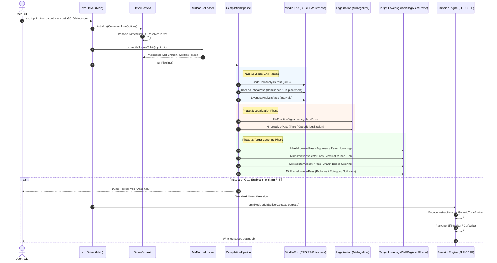

# EzCompiler: End-to-End Compiler Driver & Compilation Pipeline

[`EzCompiler`](file:///E:/Repos/EzPacker/EzCompiler) is the top-level driver executable (`ezc`) and reusable compilation library (`EzCompilerLib`) of the **EzPacker** compiler toolchain. It unites frontend source ingestion, middle-end SSA optimization, target legalization, instruction selection, register allocation, frame layout, and binary object emission into a seamless, modular compilation pipeline.

---

## Architecture & Compilation Pipeline Flow

The following sequence diagram traces compilation from high-level input down to relocatable object files:



---

## Command-Line Interface (`ezc`)

The standalone compiler executable is driven by [`CommandLineParser`](file:///E:/Repos/EzPacker/EzCompiler/include/CommandLineOptions.h#L58), built on **argparse**.

### Synopsis
```bash
ezc [options] <input>
```

### Options Reference Table

| Flag | Parameter | Default | Description |
|:---|:---|:---|:---|
| `<input>` | `<file>` | *None* | Input source file (`.ez`) or intermediate representation (`.mir`). |
| `-o`, `--output` | `<path>` | `a.out` / `a.obj` | Destination binary object, assembly, or MIR file path. |
| `-S` | *None* | `false` | Stop after target lowering; emit human-readable assembly text (`.s`). |
| `--target` | `<triple>` | Host Triple | Target architecture/OS triple (e.g. `x86_64-linux-gnu`, `x86_64-windows-msvc`). |
| `--emit-mir` | *None* | `false` | Inspection gate: stop after frontend lowering and dump generic SSA MIR. |
| `--emit-legalized-mir` | *None* | `false` | Inspection gate: stop after legalization and dump legalized MIR. |
| `--emit-lowered-mir` | *None* | `false` | Inspection gate: stop after register allocation and dump target-lowered MIR. |
| `-O0` | *None* | `true` | Optimization level: disable optimizations (fastest build time). |
| `-O1` | *None* | `false` | Optimization level: basic optimizations. |
| `-O2` | *None* | `false` | Optimization level: full optimizations (SSA, SIB folding, graph coloring). |
| `-Os` | *None* | `false` | Optimization level: optimize primarily for code size. |
| `-v`, `--verbose` | *None* | `false` | Enable verbose compiler diagnostic and trace logging. |
| `--print-passes` | *None* | `false` | Print compiler pass names in execution order to stdout. |
| `--time-passes` | *None* | `false` | Report per-pass execution duration benchmarks in milliseconds. |
| `-fPIC` | *None* | `false` | Generate position-independent code (GOT/PLT references). |
| `--diag-level` | `<level>` | `warning` | Minimum diagnostic severity threshold: `error`, `warning`, `trace`, `debug`. |
| `--diag-out` | `<path>` | *stderr* | Divert formatted compiler diagnostics to a dedicated log file. |
| `-mattr`, `--target-feature` | `<features>` | *None* | Enable or disable target CPU features/extensions (e.g. `+avx2,-sse`). |
| `-V`, `--version` | *None* | `false` | Print compiler version banner and exit. |
| `-h`, `--help` | *None* | `false` | Display command-line usage and flag options. |

---

## Core Classes & Architecture

### 1. Target Triple & Resolution (`EzCompiler/include/TargetTriple.h`, `TargetResolver.h`)

* **[`TargetTriple`](file:///E:/Repos/EzPacker/EzCompiler/include/TargetTriple.h)**:
  - Models the canonical four-part compiler target: `<arch>-<vendor>-<sys>-<abi>`.
  - [`TargetTriple::getHostTriple()`](file:///E:/Repos/EzPacker/EzCompiler/include/TargetTriple.h#L32): Dynamically detects host architecture and operating system at runtime.
  - Shorthand parsing handles common single-token and two-token forms (e.g. `"x86_64"` expands to `x86_64-unknown-linux-gnu` or `x86_64-pc-windows-msvc`).
  - Format query predicates:
    - [`isX86_64()`](file:///E:/Repos/EzPacker/EzCompiler/include/TargetTriple.h#L47): Matches `x86_64`, `amd64`, `x64`.
    - [`isWindows()`](file:///E:/Repos/EzPacker/EzCompiler/include/TargetTriple.h#L52): Detects Windows PE targets.
    - [`isLinux()`](file:///E:/Repos/EzPacker/EzCompiler/include/TargetTriple.h#L57): Detects Linux targets.
    - [`isElf()`](file:///E:/Repos/EzPacker/EzCompiler/include/TargetTriple.h#L62): Indicates ELF object format requirement.
    - [`isCoff()`](file:///E:/Repos/EzPacker/EzCompiler/include/TargetTriple.h#L67): Indicates PE/COFF object format requirement.

* **[`TargetResolver`](file:///E:/Repos/EzPacker/EzCompiler/include/TargetResolver.h)**:
  - Pluggable factory registry pattern decoupling compiler driver logic from concrete hardware backends.
  - Architectures register factory callbacks via [`TargetResolver::registerTarget(arch, factory)`](file:///E:/Repos/EzPacker/EzCompiler/include/TargetResolver.h#L45).
  - Calling [`TargetResolver::resolve()`](file:///E:/Repos/EzPacker/EzCompiler/include/TargetResolver.h#L56) produces a [`ResolvedTarget`](file:///E:/Repos/EzPacker/EzCompiler/include/TargetResolver.h#L18) bundle containing:
    - `m_targetDesc`: Owning pointer to target hardware descriptor ([`TargetDesc`](file:///E:/Repos/EzPacker/EzTriple/include/Descriptors/TargetDesc.h)).
    - `m_callingConv`: Non-owning view of target ABI calling convention ([`CallingConvDesc`](file:///E:/Repos/EzPacker/EzMir/include/Function/CallingConvDesc.h)).
    - `m_binaryDesc`: Non-owning view of target binary container format ([`TargetBinaryDesc`](file:///E:/Repos/EzPacker/EzTriple/include/Descriptors/TargetBinaryDesc.h)).

---

### 2. Execution Driver Context (`EzCompiler/include/DriverContext.h`)

* **[`DriverContext`](file:///E:/Repos/EzPacker/EzCompiler/include/DriverContext.h)**:
  - Coordinates resource ownership across the entire compilation session.
  - Backed by a 1MB monotonic memory arena (`m_sessionArena`).
  - Manages compilation session singletons:
    - [`SourceManager`](file:///E:/Repos/EzPacker/EzCore/include/SourceManager/SourceManager.h): Manages input source files and byte-offset mapping.
    - [`DiagnosticCollector`](file:///E:/Repos/EzPacker/EzCore/include/Diagnostics/DiagnosticCollector.h) & [`DiagnosticLogger`](file:///E:/Repos/EzPacker/EzCore/include/Diagnostics/DiagnosticLogger.h): Collects and formats diagnostics.
    - [`MirTypeTable`](file:///E:/Repos/EzPacker/EzMir/include/Type/MirType.h): Canonical interned types.
    - [`MirBuilderContext`](file:///E:/Repos/EzPacker/EzMir/include/Builder/MirBuilderContext.h): Root MIR module holding all functions and globals.
    - Resolved target descriptors ([`TargetDesc`](file:///E:/Repos/EzPacker/EzTriple/include/Descriptors/TargetDesc.h), [`CallingConvDesc`](file:///E:/Repos/EzPacker/EzMir/include/Function/CallingConvDesc.h), [`TargetBinaryDesc`](file:///E:/Repos/EzPacker/EzTriple/include/Descriptors/TargetBinaryDesc.h)).

---

### 3. Frontend Ingestion & Module Loading (`EzCompiler/include/FrontendAdapter.h`)

* **[`IFrontendAdapter`](file:///E:/Repos/EzPacker/EzCompiler/include/FrontendAdapter.h#L18)**:
  - Abstract interface decoupling frontend language parsers from compilation orchestration:
    `virtual bool compileSourceToMir(DriverContext &ctx, std::string_view sourcePath, MirBuilderContext &outMirCtx) = 0`.
* **[`MirModuleLoader`](file:///E:/Repos/EzPacker/EzCompiler/include/FrontendAdapter.h#L33)**:
  - Production adapter for textual `.mir` files using [`MirParser`](file:///E:/Repos/EzPacker/EzMir/include/Parser/MirParser.h).
  - Also supplies programmatic synthetic module builders used for testing:
    - [`createReturnConstFunction()`](file:///E:/Repos/EzPacker/EzCompiler/include/FrontendAdapter.h#L52): Generates test functions returning constant scalars.
    - [`createArithmeticFunction()`](file:///E:/Repos/EzPacker/EzCompiler/include/FrontendAdapter.h#L57): Generates 64-bit arithmetic test pipelines.

---

### 4. Compilation Pipeline Orchestrator (`EzCompiler/include/CompilationPipeline.h`)

[`CompilationPipeline`](file:///E:/Repos/EzPacker/EzCompiler/include/CompilationPipeline.h) drives the transformation of generic high-level MIR into target-lowered machine instructions across three structured phases:

1. **Middle-End Phase ([`runMiddleEndPasses`](file:///E:/Repos/EzPacker/EzCompiler/include/CompilationPipeline.h#L49))**:
   - [`CodeFlowAnalysisPass`](file:///E:/Repos/EzPacker/EzMir/include/MirPasses/Passes/CodeFlowAnalysisPass.h): Constructs block predecessor/successor Control Flow Graphs.
   - [`NonSsaToSsaPass`](file:///E:/Repos/EzPacker/EzMir/include/MirPasses/Passes/NonSsaToSsaPass.h): Computes Cooper-Harvey-Kennedy dominators, iterated dominance frontiers, places minimal $\phi$-nodes, and renames variables into SSA form.
   - [`LivenessAnalysisPass`](file:///E:/Repos/EzPacker/EzMir/include/MirPasses/Passes/LivenessAnalysisPass.h): Solves backward dataflow equations to compute live-in and live-out variable intervals.
2. **Legalization Phase ([`runLegalizationPasses`](file:///E:/Repos/EzPacker/EzCompiler/include/CompilationPipeline.h#L55))**:
   - `MirFunctionSignatureLegalizerPass`: Adjusts parameter and return classifications for target ABI compatibility.
   - `MirLegalizerPass`: Driven by target `.lad` legalization action matrices. Widens, narrows, or rewrites illegal scalar types and opcodes.
3. **Target Lowering Phase ([`runTargetLoweringPasses`](file:///E:/Repos/EzPacker/EzCompiler/include/CompilationPipeline.h#L61))**:
   - `MirAbiLowererPass`: Lowers calling convention tokens (`PUSH_ARG`, `CALL`, `PUSH_RET`, `RET`) into physical registers and stack arguments according to ABI rules.
   - `MirInstructionSelectorPass`: Maximal Munch tree pattern matcher translating generic IR instructions into concrete target machine instructions (`TARGET_INST`).
   - `MirRegisterAllocatorPass`: Chaitin-Briggs graph coloring register allocator. Builds interference graphs, simplifies non-interfering nodes, spills uncolorable virtual registers to stack slots, and rewrites operands to physical registers.
   - `MirFrameLowererPass`: Computes stack frame sizes, preserves callee-saved registers, adjusts stack pointers in prologues/epilogues, and converts stack slot references into base-plus-displacement memory operands (`[RBP - offset]`).

---

### 5. Binary Emission Engine (`EzCompiler/include/EmissionEngine.h`)

[`EmissionEngine`](file:///E:/Repos/EzPacker/EzCompiler/include/EmissionEngine.h) takes the lowered MIR module and packages it into executable object files:
1. Obtains target-specific machine code emitter ([`GenericCodeEmitter`](file:///E:/Repos/EzPacker/EzCodeEmitter/include/GenericCodeEmitter.h)) from the target descriptor.
2. Emits byte streams into [`CodeSection`](file:///E:/Repos/EzPacker/EzCodeEmitter/include/CodeSection.h) instances (`.text`, `.rodata`, `.data`, `.bss`).
3. Tracks defined functions and globals as [`ObjectSymbol`](file:///E:/Repos/EzPacker/EzCodeEmitter/include/ObjectFormat/ObjectSymbol.h) instances.
4. Resolves intra-module branches and external call fixups through `TargetRelocationResolver`.
5. Selects concrete object writer:
   - For ELF targets: [`Elf64Writer`](file:///E:/Repos/EzPacker/EzCodeEmitter/include/ObjectFormat/Elf64Writer.h) serializes System V AMD64 `.o` objects.
   - For COFF targets: [`CoffWriter`](file:///E:/Repos/EzPacker/EzCodeEmitter/include/ObjectFormat/CoffWriter.h) serializes Windows PE/COFF `.obj` objects.
6. Writes the final byte stream to disk.

---

## Usage Examples

### 1. Command-Line Invocation

```bash
# 1. Compile textual MIR to Linux ELF64 relocatable object file
ezc input.mir -o output.o --target x86_64-linux-gnu -O2

# 2. Compile to Windows PE/COFF relocatable object file
ezc input.mir -o output.obj --target x86_64-windows-msvc

# 3. Stop after target lowering and emit assembly text
ezc input.mir -S -o output.s

# 4. Inspect intermediate SSA MIR after middle-end passes
ezc input.mir --emit-mir

# 5. Inspect legalized MIR after type legalization
ezc input.mir --emit-legalized-mir

# 6. Profile compiler pass execution durations
ezc input.mir -o output.o --print-passes --time-passes
```

### 2. Programmatic C++ API Usage

```cpp
#include "CommandLineOptions.h"
#include "DriverContext.h"
#include "FrontendAdapter.h"
#include "CompilationPipeline.h"
#include "EmissionEngine.h"
#include "EzTargetsX86_64Registration.h"
#include <iostream>

bool compileModuleProgrammatically(std::string_view mirPath, std::string_view objPath)
{
    // 1. Register supported hardware target factories
    EzTargets::X86_64::registerTarget();

    // 2. Set up compilation options
    EzCompiler::CommandLineOptions options;
    options.inputFilePath = mirPath;
    options.outputFilePath = objPath;
    options.target = EzCompiler::TargetTriple::parse("x86_64-linux-gnu");
    options.optLevel = EzCompiler::OptimizationLevel::O2;
    options.verbose = true;

    // 3. Initialize execution session context
    EzCompiler::DriverContext ctx(options);
    if (!ctx.initialize())
    {
        std::cerr << "Failed to initialize target architecture\n";
        return false;
    }

    // 4. Ingest textual MIR source
    EzCompiler::MirModuleLoader loader;
    if (!loader.compileSourceToMir(ctx, options.inputFilePath, *ctx.getBuilderContext()))
    {
        std::cerr << "Failed to parse input MIR\n";
        return false;
    }

    // 5. Run end-to-end compilation pipeline (SSA, Legalization, ISel, RegAlloc, Frame)
    EzCompiler::CompilationPipeline pipeline(ctx);
    if (!pipeline.runPipeline())
    {
        std::cerr << "Compilation pipeline failed\n";
        return false;
    }

    // 6. Emit binary object file
    EzCompiler::EmissionEngine emitter(ctx);
    return emitter.emitModule(*ctx.getBuilderContext(), options.outputFilePath);
}
```

---

## Testing & Verification

The test suite for `EzCompiler` covers both component unit tests and full end-to-end compilation runs:

### Unit Tests ([`tests/EzCompilerTestSuite/tests/`](file:///E:/Repos/EzPacker/tests/EzCompilerTestSuite/tests/))
- [`T_CommandLineParser.cpp`](file:///E:/Repos/EzPacker/tests/EzCompilerTestSuite/tests/T_CommandLineParser.cpp): Validates argument parsing, target triple inference, flag combinations, and diagnostic thresholds.
- [`T_TargetResolver.cpp`](file:///E:/Repos/EzPacker/tests/EzCompilerTestSuite/tests/T_TargetResolver.cpp): Tests target triple parsing, host detection, factory registration, and descriptor retrieval.
- [`T_EndToEndCompilation.cpp`](file:///E:/Repos/EzPacker/tests/EzCompilerTestSuite/tests/T_EndToEndCompilation.cpp): Tests programmatic end-to-end compilation runs across optimization levels.

### End-to-End Tests ([`tests/EzCompilerEndToEndTests/`](file:///E:/Repos/EzPacker/tests/EzCompilerEndToEndTests/))
Ten complete test cases compiling `.mir` programs into native `.o` and `.obj` files, running them against C harness tests, and validating binary headers with `elf_validator`:
- `01_arithmetic_logic`: 64-bit and 32-bit ALU operations, immediate folding, signed division.
- `02_branch_and_loops`: Loops, conditional branches, forward/backward jumps.
- `03_calling_conventions`: Multi-argument calls, register passing, stack parameter alignment.
- `04_memory_access`: Pointer loads, stores, scaled index addressing.
- `05_recursion_and_calls`: Recursive Fibonacci, call frame alignment, callee-saved register preservation.
- `06_phi_and_control_flow`: Multi-predecessor $\phi$-nodes and SSA loop variables.
- `07_floating_point`: IEEE single and double precision math, XMM registers, conversions.
- `08_comparisons`: Relational operators, condition codes, branch tests.
- `09_bitwise_logic`: Shifts, masks, bitwise inversions.
- `10_memory_and_aggregates`: Structs, array indexing, and memory offsets.
