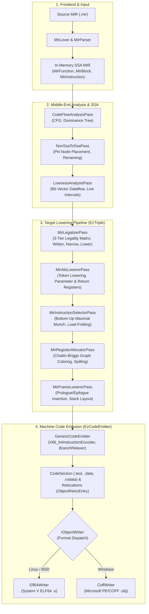

# EzPacker: Modern C++20 Compiler Backend & Code Generation Framework

Welcome to the comprehensive documentation for **EzPacker**.

EzPacker is a modular, high-performance compiler backend, machine intermediate representation (MIR) framework, and binary code generation engine written in ISO C++20. It accepts strongly-typed, SSA-form machine intermediate representation and transforms it into native, relocatable machine code object files (**ELF64** for Linux; **PE/COFF** for Windows) targeting x86-64 with SSE and AVX vector extensions.

---

## 1. Global Architecture Overview

EzPacker's end-to-end pipeline cleanly separates target-independent optimization and lowering stages from architecture-specific definitions:



### The Declarative DSL Architecture (`EzDsl`)
Instead of hand-coding thousands of lines of fragile C++ tables for hardware registers, instruction encodings, and calling conventions, EzPacker uses a suite of domain-specific languages:

```mermaid
flowchart LR
    subgraph DSLInputs["Declarative DSL Sources"]
        TDesc[".tdesc\n(Target Descriptors)"]
        EZCC[".ezcc\n(Calling Conventions)"]
        LAD[".lad\n(Legalization Actions)"]
        LRD[".lrd\n(Rewrite Rules)"]
        IDF[".idf\n(Instructions & Encodings)"]
        ISF[".isf\n(Pattern Matching Trees)"]
    end

    subgraph Toolchain["EzDsl Meta-Compiler Toolchain"]
        Lexer["EzDsl::Lexer\n(lexy combinators)"]
        Sema["EzDsl::Sema\n(Type checking & dialects)"]
        CodeGen["EzDsl::CodeGenerators\n(C++ synthesizers)"]
    end

    subgraph Runtime["Synthesized C++ Artifacts"]
        Headers["Runtime Lookup Tables\n& Matcher Classes"]
    end

    DSLInputs --> Lexer --> Sema --> CodeGen --> Headers
    Headers --> Lowering
```



---

## 2. Core Capabilities & Design Highlights

- **Pure C++20 Design**: Leverages concepts, `<format>`, ranges, and polymorphic memory resources (`std::pmr`) for memory efficiency and zero heap fragmentation during pass execution.
- **Table-Driven 3-Tier Legalizer**: Dense primary matrix indexed by opcode and compact type provides $O(1)$ legality dispatch, combined with multi-slot signature matchers and declarative strength reduction rules.
- **Bottom-Up Maximal Munch Instruction Selection**: Tree-matching pattern matching that automatically synthesizes SIB addressing modes and performs opportunistic memory load-folding (`ADD64rm`).
- **Production Chaitin-Briggs Graph-Coloring Register Allocator**: Full interference graph construction, loop-depth spill cost estimation, optimistic simplification, register spilling, and copy coalescing.
- **Dual Calling Convention & Binary Format Support**: Built-in support for both **System V AMD64** (Linux/macOS) and **Microsoft Win64** (Windows) calling conventions, with native emitters for **ELF64** (`.o`) and **PE/COFF** (`.obj`).
- **Complete Vector Extension Support**: Implication-aware CPU feature tracking supporting SSE, SSE2, SSE3, SSSE3, SSE4.1, SSE4.2, AVX, and AVX2.

---

## 3. Documentation Navigation

### 📖 Essential Guides
- **[First Steps & Quickstart](first_steps.md)**: Write your first MIR module, compile to native object code, inspect intermediate pipeline states, and link with host C/C++ toolchains.
- **[Comprehensive Build Guide](build_guide.md)**: Toolchain requirements, CMake configuration options, step-by-step compilation on Windows and Linux, running test suites, and generating docs.
- **[Examples & Use Cases](examples.md)**: In-depth technical walkthrough of all 9 bundled MIR modules (arithmetic, control flow, ABI lowering, crypto hashing, load-folding, recursion, and epilogues).
- **[How to Build a Target Architecture](how_to_build_a_target.md)**: Complete architectural tutorial on adding a new CPU architecture backend to EzPacker from first principles.

### 🏛️ Subproject Overviews
Every non-vendored subproject in the repository is documented in detail:

| Subproject | Description | Documentation |
| :--- | :--- | :--- |
| **`EzCore`** | Foundational utilities: PMR allocators, diagnostic engine, `FlexInt`/`FlexFloat`, `DenseBitSet`, `IntrusiveLinkedList`, `SourceManager`. | [EzCore Guide](projects/EzCore.md) |
| **`EzMir`** | Machine Intermediate Representation: `MirFunction`, `MirBlock`, `MirInstruction`, `MirOperand`, `MirType`, SSA pass framework, parser, and printer. | [EzMir Guide](projects/EzMir.md) |
| **`EzDsl`** | Meta-compiler toolkit: Lexer, Sema, CodeGenerators, and `EzDslCli` driver for all 10 DSL dialects. | [EzDsl Guide](projects/EzDsl.md) |
| **`EzCodeEmitter`** | Binary code emission: section management, relocations, `Elf64Writer` (ELF64), and `CoffWriter` (PE/COFF). | [EzCodeEmitter Guide](projects/EzCodeEmitter.md) |
| **`EzTriple`** | Target-independent backend lowering: Legalizer, ABI lowerer, instruction selector, register allocator, and frame lowerer. | [EzTriple Guide](projects/EzTriple.md) |
| **`EzCompiler`** | Driver application: command-line parsing, `DriverContext`, target resolver, compilation pipeline, and emission engine (`ezc`). | [EzCompiler Guide](projects/EzCompiler.md) |
| **`EzTargets`** | Architecture backends: self-contained x86-64 target (`X86_64TargetDesc`, `X86_64FrameLowerer`, `X86_64InstructionEncoder`, `BranchRelaxer`). | [EzTargets Guide](projects/EzTargets.md) |

### 🔍 Complete API Reference
- **[Generated Doxygen API Documentation](doxygen/index.html)**: Interactive class hierarchies, inheritance diagrams, member documentation, and source code cross-references.

---

## 4. Quick Taste of EzPacker

```mir
// compute.mir
fn @dot3(i32 %x1, i32 %y1, i32 %x2, i32 %y2) -> i32 {
entry:
    %p1 = IMUL i32 %x1, %y1;
    %p2 = IMUL i32 %x2, %y2;
    %dot = ADD i32 %p1, %p2;
    RET i32 %dot;
}
```

Compile directly to an assembly listing:
```bash
EzCompiler compute.mir --emit-asm
```

Generated x86-64 Assembly (Linux System V AMD64):
```nasm
dot3:
    push    rbp
    mov     rbp, rsp
    imul    edi, esi
    imul    edx, ecx
    add     edi, edx
    mov     eax, edi
    mov     rsp, rbp
    pop     rbp
    ret
```
